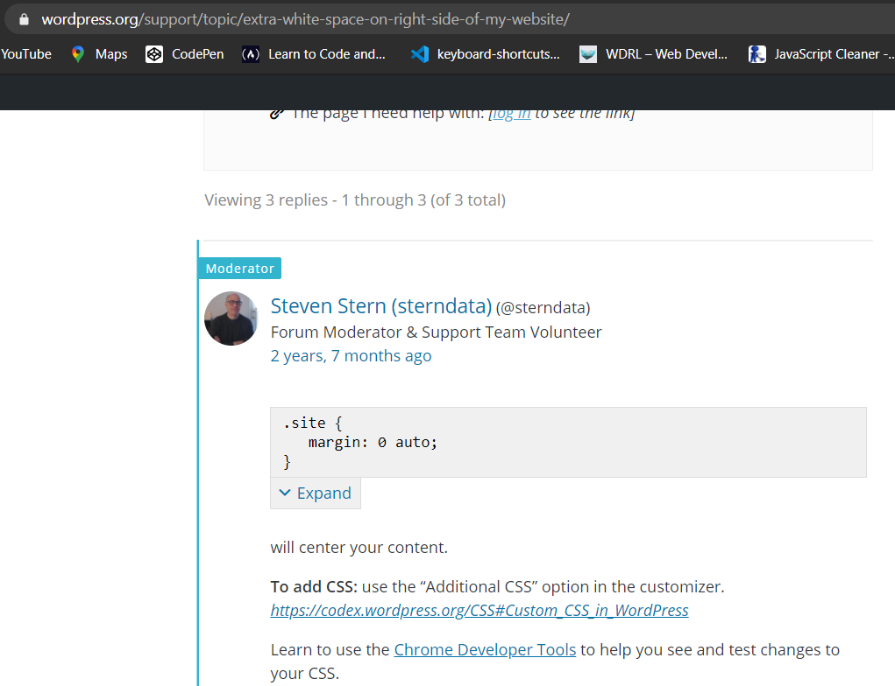

# 🖥️ Web Dev Wiki 🌎🌏🌍
## 🙋 What is this?
<b>Web Dev Wiki</b> is a markdown file containing resources for various topics in web development. There are links to helpful articles/repos, code snippets, and images to help you become a better developer.

## 🕮 How To Use
Simply browse the table of contents below to access available resources for a variety of topics in web development.

## 🤓 Contribute
Do you know of any helpful articles that should be included here? Do you have a trusty code snippet that you use all the time when working with a certain language/framework? Make a pull request or open an issue and let me know! I would love to include examples from other developers. This is very much a work in progress.
<br><br>
Enjoy!
<br><br>

# 📋 Table of Contents

1. [CSS](#css)
2. [React](#⚛️-React)
3. [Selenium](#🧪-Selenium)
4. [Wordpress](#wordpress)
***
# Adobe Experience Manager
setting up a local dev environment in AEM: https://experienceleague.adobe.com/docs/experience-manager-learn/foundation/development/set-up-a-local-aem-development-environment.html?lang=en#development

info on CRXDE Lite: https://helpx.adobe.com/experience-manager/6-3/sites/developing/using/developing-with-crxde-lite.html

<i>default access to CRXDE Lite is:</i>http://localhost:4502/crx/de

### Apache Sling
https://sling.apache.org/<br>
>"In a nutshell, Sling maps HTTP request URLs to content resources based on the request's path, extension, and selectors. Using convention over configuration, requests are processed by scripts and servelets, dynamically selected based on the current resource. This fosters meaningful URLs and resource driven request processing, while the modular nature of Sling allows for specialized server instances that include only what is needed."

# CSS
https://www.youtube.com/watch?v=qm0IfG1GyZU&feature=emb_logo

## <details>styling a \<details\> element like a \<select\> element:
https://css-tricks.com/quick-reminder-that-details-summary-is-the-easiest-way-ever-to-make-an-accordion/

# GitHub
https://levelup.gitconnected.com/10-github-repos-that-can-help-you-grow-as-a-web-developer-56a640d9771a

free API's:
https://github.com/public-apis/public-apis

# HTTP
using HTTP instead of WebSockets, for example: https://dev.to/nwtgck/the-power-of-pure-http-screen-share-real-time-messaging-ssh-and-vnc-5ghc

# JavaScript
color shifting: https://jsfiddle.net/akinuri/dd2p9mgL/


# Jest
https://dev.to/andyhaskell/making-custom-jest-assertion-matchers-in-javascript-and-typescript-15ij

# jQuery
https://stackoverflow.com/questions/65272021/i-cannot-figure-out-why-the-first-time-i-click-on-item-i-get-expected-behavior-b


# ⚛️ React
## React Topics & Resources
brillout: a react component library: https://github.com/brillout/awesome-react-components


visx: a collection of expressive, low-level visualization primitives for React
https://airbnb.io/visx/drag-ii


React dashboards
https://flatlogic.com/templates/react-dashboard?ref=c_sw5ZRBoi

React-Draggable
<i>A simple component for making elements draggable</i>
https://www.npmjs.com/package/react-draggable


Nice useState example for data fetching:
https://dev.to/tkdodo/don-t-over-usestate-4k72

Good hooks explanation: https://dev.to/olenadrugalya/understanding-hooks-what-and-why-2kb0

Recursion in React: https://dev.to/nas5w/creating-a-recursive-list-menu-any-number-of-levels-deep-in-react-4i2g

React Reveal - Animated reveal effects in React:
https://www.react-reveal.com/

Nice React + WordPress Headless CMS Intro: https://dev.to/technolaaji/using-react-as-a-wordpress-theme-4dao

More WordPress + React
https://javascriptforwp.com/adding-react-to-a-wordpress-theme-tutorial/


# 🧪 Selenium
## Selenium Topics & Resources

Generate Extent Reports In Selenium WebDriver:
https://www.softwaretestinghelp.com/extent-reports-selenium-webdriver/

Create Responsive UI Reporting
https://www.linkedin.com/pulse/extent-reports-delightful-responsive-ui-reporting-ajuram-salim/


More about Selenium reporting
https://www.guru99.com/testng-report.html

Good walk-through of Selenium Automation
https://www.smashingmagazine.com/2018/04/feature-testing-selenium-webdriver/


## [Fourth Example](http://www.fourthexample.com) Topics & Resources


## supports gifs


- was this helpful? section/description

***need canonical index, with guides, tutorials, runbooks, and FAQs***

***needs like an Articles section that has subsections based on topic.  Here's a cool article, btw:*** https://increment.com/frontend/when-frontend-means-full-stack/

# Starting a Spring Boot Project With Eclipse

1. start at start.spring.io
2.	fill this out:

 
3.	Unzip the file you made and put it in your dev folder (wherever you keep your projects)
4.	Open Eclipse
5.	File > Import > Existing Maven Project
6.	Browse to the root folder of the project
7.	Click “Finish”, which will download all dependencies in the pom.xml file
8.	Open the main file and right click on the method and Run As Java Application:

 
# How To Kill A Process Running On A Specific Port (Windows)
")
### ...and if the above example does not work, try running:
```
npx kill-port 3000
```

# WordPress
## How To Run WordPress Locally With XAMPP
https://themeisle.com/blog/install-xampp-and-wordpress-locally/

## How to solve 403 Error in WordPress
https://kinsta.com/blog/403-forbidden-error/

## How to fix extra white space on side of screen:

